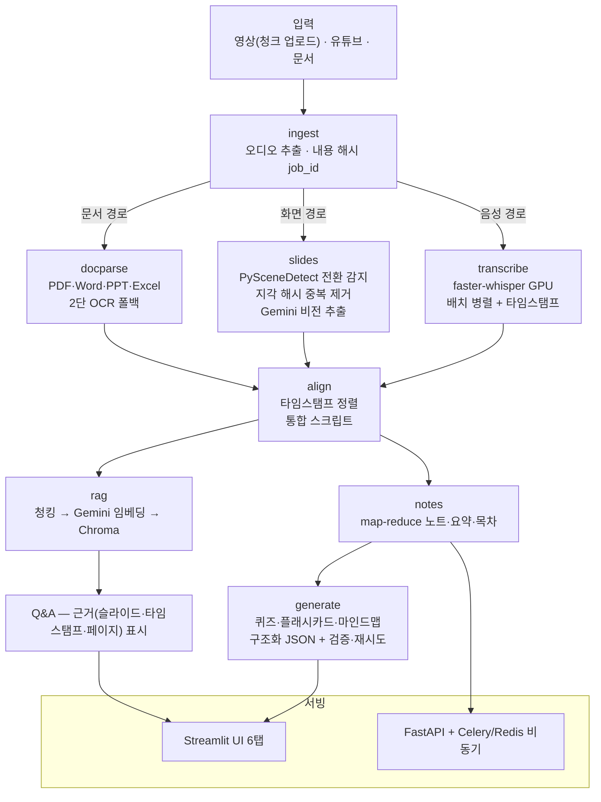

# 🎓 AI 학습 도우미 (PPT 강의 멀티모달)

PPT 강의 영상(음성 + 슬라이드)·유튜브·문서를 넣으면 **구조화 노트 · 요약 · 시간대별 목차 · 퀴즈 · 플래시카드 · 마인드맵 · 근거 표시 Q&A(RAG)** 를 자동 생성하는 학습 웹 서비스.

> 흔한 "음성만 듣는" 도구와 달리, **슬라이드의 표·그래프·코드까지 Gemini 비전으로 읽어** 음성과 타임스탬프로 정렬해 처리한다.

## 아키텍처



- 모든 단계는 `data/jobs/{job_id}/`에 **체크포인트**를 남긴다 → 실패 시 이어서 재시작, 동일 입력 재처리 방지(내용 해시 기반 캐싱).
- 모듈 간 결합은 파일(json)로만 — 단계별 독립 실행·교체 가능, Celery 태스크가 자연히 멱등.

## 실행 환경

- Windows 11, Python 3.12, NVIDIA GPU(8GB VRAM 이상 권장)
- ffmpeg (`winget install Gyan.FFmpeg`)
- CUDA Toolkit **설치 불필요** — cuBLAS·cuDNN을 pip으로 받아 가상환경만으로 GPU 동작

## 설치·실행

```powershell
python -m venv .venv
.venv\Scripts\pip install -r requirements.txt
copy .env.example .env    # GEMINI_API_KEY 입력

# 전체 스택 실행 (Redis + Celery worker + FastAPI + UI) — 표준 실행 방법
.\run_all.ps1

# 외부 공유 (Cloudflare Quick Tunnel — 공개 URL 발급, 창 닫으면 즉시 무효)
.\share_url.ps1
```

### 접근 통제 (비밀번호 게이트)

- 첫 화면에서 **4자리 비밀번호**로 입장: 신규 등록(중복 불가) 또는 기존 번호 입력
- 사용자별 자료 격리 — 자기가 분석한 자료만 히스토리에 보인다 (PIN은 해시로만 저장)
- 분석은 백그라운드 워커에서 실행 — **브라우저를 닫아도 계속**되고, 재접속하면 진행률·예상 남은 시간이 보인다
- 실서비스 전환 시 구글 OAuth로 교체 예정 (`.streamlit/secrets.toml.example` 참고)

CLI로 단계별 실행도 가능:

```powershell
.venv\Scripts\python -m src.ingest "강의.mp4"        # → job_id
.venv\Scripts\python -m src.transcribe <job_id>       # GPU STT
.venv\Scripts\python -m src.slides <job_id>           # 슬라이드 비전 분석
.venv\Scripts\python -m src.align <job_id>            # 정렬
.venv\Scripts\python -m src.notes <job_id> --detail 상
.venv\Scripts\python -m src.generate <job_id> quiz --difficulty 어려움
.venv\Scripts\python -m src.rag <job_id> "질문 내용"
```

### 유튜브 입력의 두 가지 모드

- **기본(권장)**: 영상(720p)까지 받아 화면 속 PPT·칠판도 분석 — 멀티모달 유지
- **`--audio-only`** (UI에선 체크박스 해제): 오디오만 받아 빠르게 — 화면 정보가 없는 팟캐스트형 강의용
- 오디오 전용으로 처리한 자료를 나중에 영상 모드로 다시 넣으면, 화면 정보가 없던 산출물(정렬·노트)만 자동 무효화하고 업그레이드한다.

### API (비동기 파이프라인)

`POST /upload/init → PUT /upload/{id}/chunk/{n} → POST /upload/{id}/complete` (중단 시 `GET /upload/{id}`로 누락 청크 확인 후 이어올리기) → `POST /ingest` → `GET /status/{job_id}` 폴링 → `GET /notes`, `POST /ask`.

### Docker

`docker compose up --build` — Redis·worker·API·UI 4개 서비스. 기본 이미지는 CPU용(데모·문서 파이프라인)이고, 컨테이너 GPU는 nvidia/cuda 베이스 + `--gpus all`로 교체 필요. 로컬 GPU에서는 `run_all.ps1` 권장.

## 성능 실측 (RTX 5060 Ti 8GB)

**2시간 강의 (9.1GB, 1080p) — 전체 파이프라인 약 30분:**

| 단계 | 결과 |
|---|---|
| 오디오 추출 | 9.1GB → 220MB WAV, 1.5분 |
| GPU STT (large-v3 int8, 배치 병렬 8) | **2.5분 — 실시간 대비 52배** |
| 슬라이드 전환 감지 (21.6만 프레임) | 10.2분 → 110장 확정 (중복 24장 지각 해시 제거) |
| Gemini 비전 110장 | 약 13분 (호출 간격 제한이 지배적) |
| 노트·요약·목차 (map-reduce 17청크) | 6.5분, 챕터 7개 |
| RAG 인덱스 / 질의 | 0.3분 / 질문당 수 초 — 근거에 "슬라이드 63, 1:03:08" 수준 정밀도 |

**22분 강의 (335MB):** 오디오 4초 → STT 2분 46초(배치 미적용 시 7.9배) → 슬라이드 45장 → 동일 입력 재처리 시 전 단계 캐시 적중 2초.

**유료 티어 병렬 모드** (`GEMINI_MIN_INTERVAL=0`): 비전 8병렬 + 노트 map 병렬 — 실측 기준 슬라이드 149장 + 노트 + 인덱스가 **2.8분** (장당 7초 → 0.5초). 무료 키에서는 자동으로 순차 모드(호출 간격 6초)로 동작한다.

## 시행착오 기록 (그대로 남긴다 — 설계 근거)

1. **모델 다운로드 오류가 "GPU 실패"로 오인** → CPU 폴백으로 22분이나 걸림. 다운로드와 장치 초기화를 분리해 해결. *교훈: 폴백 로직은 실패 원인을 구분해야 한다.*
2. **`cublas64_12.dll` 로드 실패** → `os.add_dll_directory`만으로 부족, ctranslate2는 PATH를 본다. PATH 주입으로 해결 — 덕분에 CUDA Toolkit 없이 pip만으로 GPU 동작.
3. **OpenCV가 한글 경로에 이미지 저장을 조용히 실패** → 21장이 "성공"인데 파일 0개. `imencode` + 파이썬 IO로 우회 + 실패 검사 추가.
4. **전환 감지 임계값 27이 슬라이드 절반을 놓침** (21/45장) → 강의 녹화는 슬라이드가 화면 일부라 변화량이 희석됨. 화면 속 페이지 번호와 대조해 15로 튜닝. *데이터로 파라미터를 결정한 사례.*
5. **플래시카드 뒷면이 문장 중간에서 잘림** → 스키마·타입 검증은 통과하는 문제. "완결된 한국어 문장은 조사로 끝나지 않는다"는 도메인 규칙으로 절단 감지 검증 추가.
6. **redis-py 8.x의 RESP3(HELLO) 강제** → Windows용 Redis 5.x와 비호환. `redis<6` 고정.
7. **Whisper 환각** → 무음 구간에서 반복 텍스트 생성. VAD 필터로 무음을 건너뛰어 해결(속도도 개선).
8. **Gemini 2.5-flash가 thinking만 하다 빈 응답 반환** (2시간 영상 36번째 슬라이드, thoughts 1,929토큰·본문 0) → 텍스트 추출류 호출은 `thinking_budget=0`으로 끄고, 빈 응답을 재시도 대상에 포함, 슬라이드 1장 실패를 격리. 수정 후 나머지 75장 실패 0 — **체크포인트 재개(35장부터)가 실전에서 작동한 사례.**

## 핵심 설계 포인트 (면접 대비)

- **멀티모달 정렬**: 음성 세그먼트의 중간 시점이 속한 슬라이드 구간에 배정. 발화 유실 금지(경계 오차는 마지막 섹션에 흡수). 영상/오디오/문서가 모두 같은 `aligned.json` 인터페이스로 수렴 → 이후 단계는 입력 유형을 모른다.
- **구조화 출력 3중 방어**: ① Gemini `response_schema`로 모델 단 형식 강제 → ② Pydantic 타입 검증 → ③ 의미 검증(정답이 보기에 있는가, 마인드맵 순환 참조 등) + 오류 되먹임 재시도 + 불량 항목만 제외.
- **비용 통제**: 전환 순간만 비전 호출, 호출 간격 제한 + 429 지수 백오프 + 호출 수 로깅, 지각 해시로 중복 프레임 사전 제거, 체크포인트·캐싱으로 재호출 방지.
- **RAG 근거 표시**: 청킹 시 위치(슬라이드 번호·타임스탬프·페이지)를 메타데이터로 보존, 문맥 주입 헤더로 검색 품질 확보, "근거에 없으면 모른다" 프롬프트로 환각 억제.

## 알려진 한계 (정직한 표기)

- STT·비전·생성 결과는 완벽하지 않다 — 발음·전문용어 인식 오류, 슬라이드 오독 가능.
- 단답형 퀴즈 정답이 가끔 문장형으로 생성됨 → 정확 일치 채점이 어려워 해설 공개 후 자가 채점 병행 권장.
- 로컬 OCR(Tesseract)은 미설치 시 자동으로 Gemini 비전 단계로 넘어감(2단 폴백의 우아한 저하) — 설치하면 API 비용 절약.
- 이미지 위주 PPTX의 OCR 폴백은 미지원 (PDF만) — PPTX 렌더링에 Office가 필요하기 때문.
- 무료 티어 기준 하루 처리량 제한 있음 (2시간 영상 1개당 비전 ~110회 + 생성 ~20회).

## 확장: 외국어 문서(해외 논문) 처리

- **자동 감지**: 언어(한글/라틴 비율 휴리스틱) + 논문 구조(섹션 표제 신호) 판별 → 경로 자동 분기
- **논문 모드**: 초록/서론/방법/결과/결론 섹션별 한국어 요약
- **원문 병기**: `--bilingual` 옵션 — 핵심 문장에 원문 인용 병기
- **삽입 도표 해석**: PDF 속 차트·수식 이미지를 Gemini 비전으로 해석해 해당 페이지 본문에 병합 (문서당 8개 상한)
- **용어집**: 원어-한국어-설명 구조화 출력 (`python -m src.generate <job_id> glossary`, UI 노트 탭 하단)

## 테스트

```powershell
.venv\Scripts\python -m pytest tests/   # 112개 — 파서·정렬·청킹·검증·업로드 프로토콜 등
```
